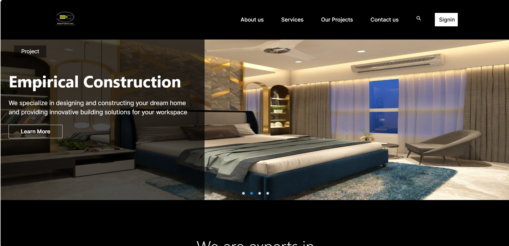
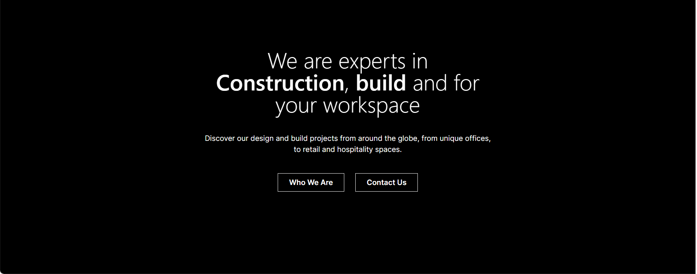
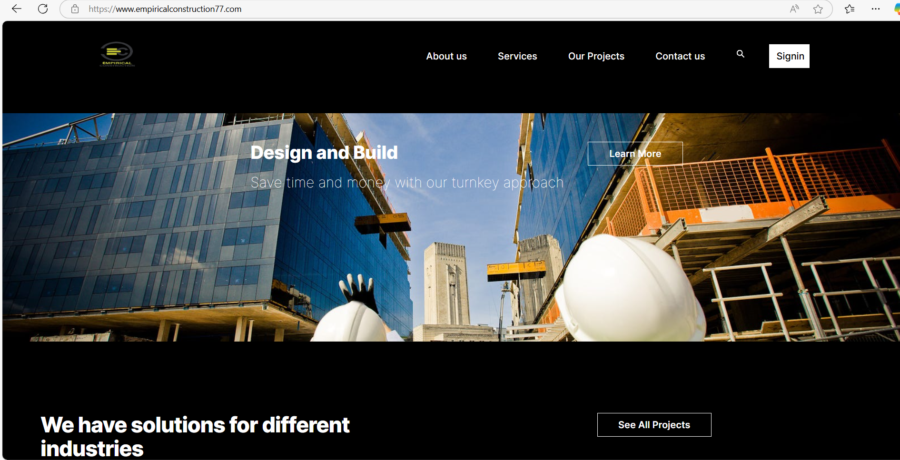
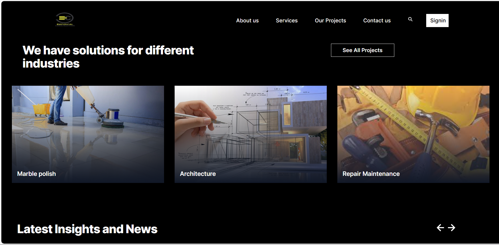
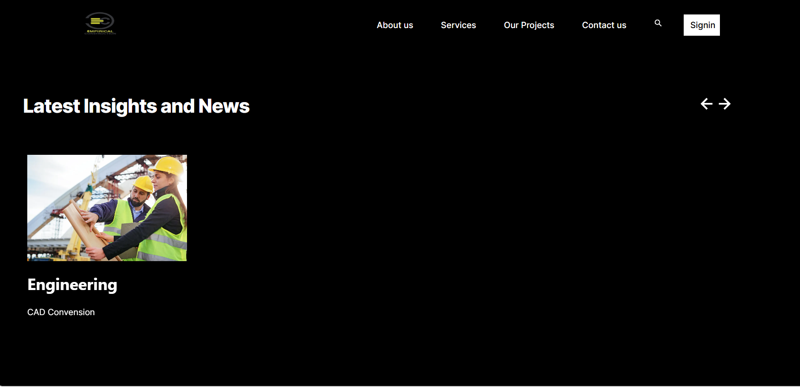

# Getting Started

# Project Overview 

EmpiricalConstruction
A web application built with Next.js, Tailwind CSS, and Clerk for a seamless, modern, and secure user experience. The platform provides an intuitive and responsive interface to handle user authentication and other features efficiently.

## Prerequisites
- Node.js and yarn/bun installed
- NextJS
- Tailwind CSS
- TypeScript
- Clerk

## Setup
1.	Clone the Repository:
git clone https://github.com/chmajidnaeem/empiricalconstruction 
2.	Install Dependencies: npm install
3.	Run the Development Server:
4.	View the Application:
Open http://localhost:3000 in your browser to see the application in action.

🔧 Commands
•	Development: npm run dev
🛠 Technology Stack
•	Next.js for server-side rendering
•	TypeScript for type safety and improved tooling
•	Tailwind CSS for responsive and efficient styling
